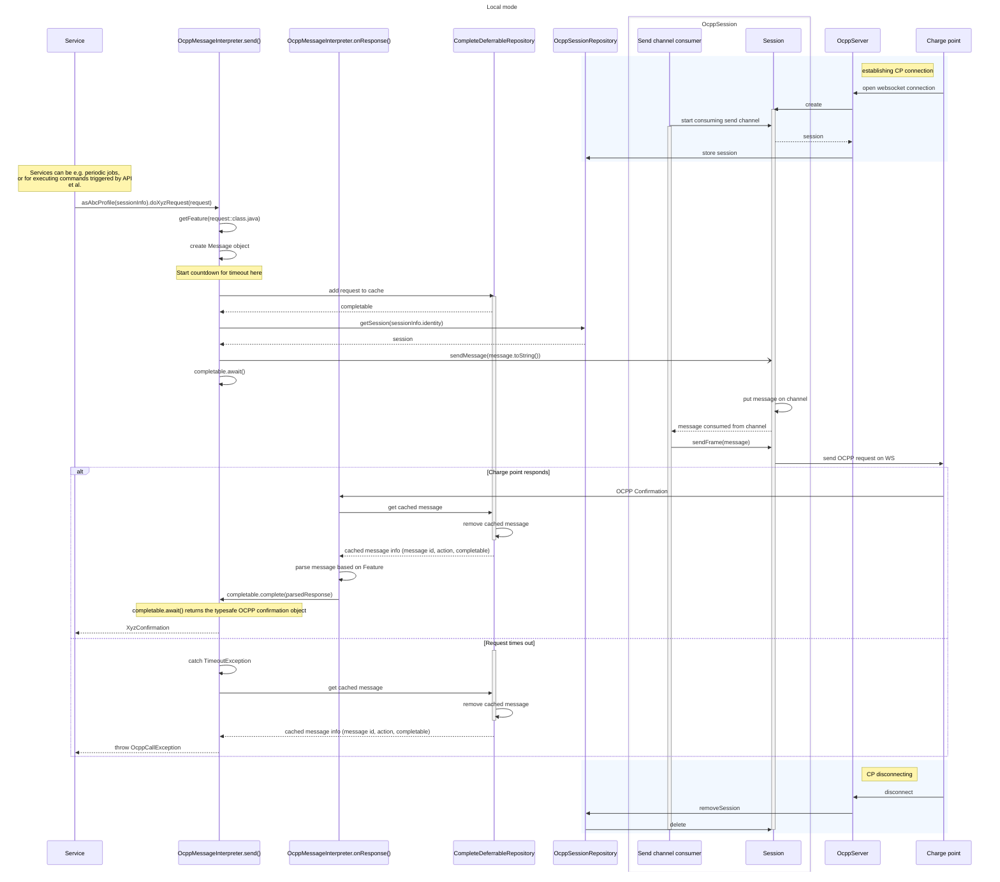
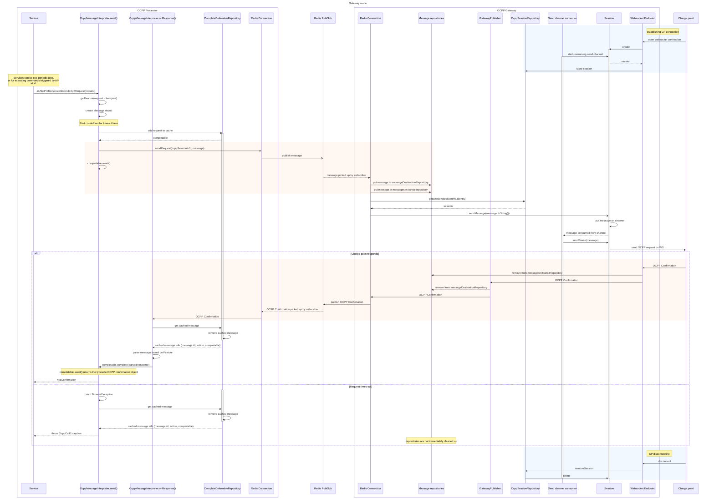

```mermaid
---
title: Local mode
---
sequenceDiagram
    participant C as Service
    participant send as OcppMessageInterpreter.send()
    participant onResponse as OcppMessageInterpreter.onResponse()
    participant DefRepo as CompleteDeferrableRepository
    participant SesRepo as OcppSessionRepository
    box OcppSession
        participant Chan as Send channel consumer
        participant Session
    end
    participant OS as OcppServer
    participant CP as Charge point

    rect rgb(0, 125, 255, 0.05)
        note right of OS: establishing CP connection
        CP ->> OS: open websocket connection
        OS ->> Session: create
        activate Session
        Chan ->> Session: start consuming send channel
        activate Chan
        Session -->> OS: session
        OS ->> SesRepo: store session
    end

    note over C: Services can be e.g. periodic jobs,<br> or for executing commands triggered by API<br>et al.
    C ->> send: asAbcProfile(sessionInfo).doXyzRequest(request)
    send ->> send: getFeature(request::class.java)
    send ->> send: create Message object
    note over send: Start countdown for timeout here
    send ->> DefRepo: add request to cache
    activate DefRepo
    DefRepo -->> send: completable
    send ->> SesRepo: getSession(sessionInfo.identity)
    SesRepo -->> send: session
    send -) Session: sendMessage(message.toString())
    send ->> send: completable.await()
    Session ->> Session: put message on channel
    Session -->> Chan: message consumed from channel
    Chan ->> Session: sendFrame(message)
    Session ->> CP: send OCPP request on WS

# alternatives
    alt Charge point responds
        CP ->> onResponse: OCPP Confirmation
        onResponse ->> DefRepo: get cached message
        DefRepo ->> DefRepo: remove cached message
        deactivate DefRepo
        DefRepo -->> onResponse: cached message info (message id, action, completable)
        onResponse ->> onResponse: parse message based on Feature
        onResponse ->> send: completable.complete(parsedResponse)
        note over send: completable.await() returns the typesafe OCPP confirmation object
        send -->> C: XyzConfirmation
    else Request times out
        activate DefRepo
        send ->> send: catch TimeoutException
        send ->> DefRepo: get cached message
        DefRepo ->> DefRepo: remove cached message
        deactivate DefRepo
        DefRepo -->> send: cached message info (message id, action, completable)
        send -->> C: throw OcppCallException
    end

# 2: timeout

    rect rgb(0, 125, 255, 0.05)
        note right of OS: CP disconnecting
        CP ->> OS: disconnect
        OS ->> SesRepo: removeSession
        SesRepo ->> Session: delete
        deactivate Chan
        deactivate Session
    end
```

Main differences highlighted in red

```mermaid
---
title: Gateway mode
---
sequenceDiagram
    box OCPP Processor
        participant C as Service
        participant send as OcppMessageInterpreter.send()
        participant onResponse as OcppMessageInterpreter.onResponse()
        participant DefRepo as CompleteDeferrableRepository
        participant RP as Redis Connection
    end
    participant R as Redis Pub/Sub
    box OCPP Gateway
        participant GWL as Redis Connection
        participant MR as Message repositories
        participant GWP as GatewayPublisher
        participant SesRepo as OcppSessionRepository
        participant Chan as Send channel consumer
        participant Session
        participant WS as Websocket Endpoint
    end
    participant CP as Charge point

    rect rgb(0, 125, 255, 0.05)
        note right of WS: establishing CP connection
        CP ->> WS: open websocket connection
        WS ->> Session: create
        activate Session
        Chan ->> Session: start consuming send channel
        activate Chan
        Session -->> WS: session
        WS ->> SesRepo: store session
    end

    note over C: Services can be e.g. periodic jobs,<br> or for executing commands triggered by API<br>et al.
    C ->> send: asAbcProfile(sessionInfo).doXyzRequest(request)
    send ->> send: getFeature(request::class.java)
    send ->> send: create Message object
    note over send: Start countdown for timeout here
    send ->> DefRepo: add request to cache
    activate DefRepo
    DefRepo -->> send: completable
    rect rgb(255, 100, 0, 0.05)
        send ->> RP: sendRequest(ocppSessionInfo, message)
        RP -) R: publish message
        send ->> send: completable.await()
        R -->> GWL: message picked up by subscriber
        GWL ->> MR: put message in messageDestinationRepository
        GWL ->> MR: put message in messagesInTransitRepository

    end

    GWL ->> SesRepo: getSession(sessionInfo.identity)
    SesRepo -->> GWL: session
    GWL -) Session: sendMessage(message.toString())
    Session ->> Session: put message on channel
    Session -->> Chan: message consumed from channel
    Chan ->> Session: sendFrame(message)
    Session ->> CP: send OCPP request on WS

# alternatives
    alt Charge point responds
        rect rgb(255, 100, 0, 0.05)
            CP ->> WS: OCPP Confirmation
            WS ->> MR: remove from messagesInTransitRepository
            WS ->> GWP: OCPP Confirmation
            GWP ->> MR: remove from messageDestinationRepository
            GWP ->> GWL: OCPP Confirmation
            GWL ->> R: publish OCPP Confirmation
            R -->> RP: OCPP Confirmation picked up by subscriber
            RP ->> onResponse: OCPP Confirmation
        end

        onResponse ->> DefRepo: get cached message
        DefRepo ->> DefRepo: remove cached message
        deactivate DefRepo
        DefRepo -->> onResponse: cached message info (message id, action, completable)
        onResponse ->> onResponse: parse message based on Feature
        onResponse ->> send: completable.complete(parsedResponse)
        note over send: completable.await() returns the typesafe OCPP confirmation object
        send -->> C: XyzConfirmation
    else Request times out
        activate DefRepo
        send ->> send: catch TimeoutException
        send ->> DefRepo: get cached message
        DefRepo ->> DefRepo: remove cached message
        deactivate DefRepo
        DefRepo -->> send: cached message info (message id, action, completable)
        send -->> C: throw OcppCallException
        note over MR: repositories are not immediately cleaned up
    end

# 2: timeout

    rect rgb(0, 125, 255, 0.05)
        note right of WS: CP disconnecting
        CP ->> WS: disconnect
        WS ->> SesRepo: removeSession
        SesRepo ->> Session: delete
        deactivate Chan
        deactivate Session
    end
```